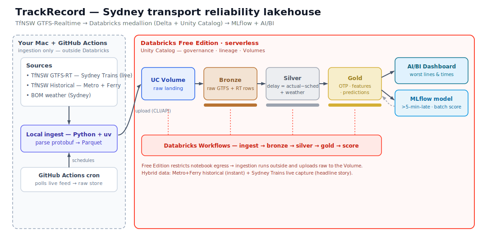

# TrackRecord — Sydney's public-transport reliability, measured end-to-end

A **data-engineering / lakehouse** project: Transport for NSW **GTFS-Realtime** feeds →
a **Databricks medallion** (Bronze → Silver → Gold on **Delta Lake + Unity Catalog**) →
an **MLflow** delay-prediction model and a **Databricks AI/BI** dashboard.

The story: **how on-time Sydney's network really is** — actual vs scheduled stop times —
**which lines and times of day are worst**, and **how much rain adds to delays**.

> Portfolio project 3 of 3 — the data-engineering lane.
> (1: *Global Pulse*, an AI/RAG news agent. 2: *GridLens*, an analytics-engineering pipeline on the NEM.)

## Architecture



Ingestion runs **outside** Databricks (your Mac + a GitHub Actions cron) and lands raw files
into a **Unity Catalog Volume** — Databricks Free Edition restricts a notebook's outbound
internet to an allowlist of trusted domains, so a serverless notebook can't be relied on to
call the TfNSW API directly. This is also just a clean raw-landing-zone pattern.

## Stack

| Layer | Choice | Why |
|---|---|---|
| **Ingestion** | Python + `httpx` + `gtfs-realtime-bindings` (managed by `uv`) | Pull GTFS-RT protobuf, parse to rows/Parquet |
| **Scheduler** | GitHub Actions cron | Free always-on poller for the Sydney Trains live feed |
| **Lakehouse** | **Databricks Free Edition** (serverless) | Unity Catalog + Delta + Workflows + DBSQL, $0 |
| **Storage** | **Delta Lake**, medallion (bronze/silver/gold) | versioned tables — the core DE pattern |
| **Governance** | **Unity Catalog** | catalog / schema / volume, lineage, permissions |
| **Orchestration** | **Databricks Workflows** | one job: ingest → bronze → silver → gold → score |
| **ML** | **MLflow** | track + register a ">5 min late" classifier; batch score |
| **Dashboard** | **Databricks AI/BI** | web-based, Mac-friendly (no Power BI / Windows dependency) |
| **Weather** | **Open-Meteo** (hourly precip) | rain/temp join for "rain adds Y min" (BOM tested first but blocks automated pulls) |

## Data sources (verified, honestly labelled)

**Transport for NSW Open Data Hub** — free, requires an API key.
- Auth header `Authorization: apikey <key>` (not Bearer). **Bronze plan: 60,000 calls/day, 5 req/sec** (verified June 2026).
- **GTFS-Realtime Trip Updates** (binary protobuf) — predicted/actual stop times → the delay signal.
- **Static GTFS** schedule bundles — the scheduled times we measure against.

Two honest constraints shaped the design (both verified June 2026):
- ⚠️ The **"Historical GTFS and GTFS Realtime"** backfill dataset currently covers **Metro + Ferry only** ("other modes over time"). So TrackRecord's backbone is a **Sydney Trains live collector** (15-min cron) accumulating real trip updates for the headline reliability story; **Metro + Ferry historical** backfill is optional/deferred.
- ⚠️ Databricks Free Edition is **serverless-only**, caps usage (overruns pause compute for the day), and **restricts notebook outbound internet** — hence the external ingestion above.

**Open-Meteo** — free, key-less **hourly precipitation + temperature** for Sydney, joined in Silver by (date, hour) for the rain-vs-delay analysis. BOM's Observatory Hill JSON was tested first but 301-redirects / blocks automated pulls and only exposes cumulative "rain since 9am", so Open-Meteo is the robust choice.

Attribution: contains data sourced from Transport for NSW; weather by Open-Meteo (CC-BY). Used for non-commercial, educational purposes.

## Phases

- [x] **Phase 0 — Setup & verify.** Repo + `uv` env (Py 3.12); TfNSW key + Databricks Free Edition created. Endpoints verified **live**: Sydney Trains trip updates on **`/v2/gtfs/realtime/sydneytrains`** (v1 → 404), vehicle positions on `/v2/gtfs/vehiclepos/...`, static GTFS on `/v1/gtfs/schedule/...`. *Live smoke test: 446 trip updates parsed, feed @ 2026-06-18 10:20 AEST.*
- [x] **Phase 1 — Bronze.** Local ingesters (`trackrecord-collect`, `trackrecord-gtfs`) → raw Parquet → **UC Volume** (`workspace.bronze.raw`) → **Bronze Delta** (`trackrecord-bronze`): `gtfs_*` (routes 137, trips 64,995, stops 1,214, stop_times 1,187,560, calendar 121) + `rt_trip_updates` + `rt_vehicle_positions`. **Live capture runs every 15 min via GitHub Actions** (`.github/workflows/collect.yml`) → Volume — verified accumulating (2 files / 7,441 rows). *Quirk: Free Edition blocks new catalogs (`InvalidState`) → we use the `workspace` catalog. Metro/Ferry historical backfill: optional/deferred now that trains accumulate live.*
- [x] **Phase 2 — Silver.** `workspace.silver.stop_delays` (`trackrecord-silver`): canonical `delay = coalesce(rt arrival/departure delay)`, deduped to the latest capture per (trip, service_date, stop), enriched with line / station / scheduled time + **weather**. **Join quirk solved:** RT↔static match on `(trip_id, stop_id)` (RT `stop_sequence` is sparse/NULL) → 98% scheduled-time coverage; Open-Meteo hourly weather joined by (date, hour). Snapshot worst T-line = T4 (Cronulla↔Bondi Jn); rain-vs-delay awaits actual rain.
- [x] **Phase 3 — Gold + dashboard.** Gold aggregates (`trackrecord-gold`): `network_kpi`, `line_punctuality`, `hourly_punctuality`, `daily_punctuality` (+ rain), `stop_punctuality`, `weather_delay`. **AI/BI (Lakeview) dashboard** built + published via SDK (`trackrecord-dashboard`; spec artifact `docs/dashboard.lvdash.json`): 3 KPI counters + by-line / by-hour / worst-stations / rain charts — **verified rendering**. Snapshot: 99.6% on-time (≤5 min); worst line T4 (Cronulla↔Bondi Jn); worst station Cronulla. *Lakeview gotcha: the widget query must be named `main_query` and linked via `spec.data.queryName`, else the server silently strips fields+encodings.*
- [x] **Phase 4 — ML (MLflow).** `trackrecord-train`: LogisticRegression(balanced) on Silver features (line, scheduled hour, day, route type, rain) → **MLflow** run → registered in **Unity Catalog** as `workspace.gold.late5_classifier` v1 → batch-scored to `workspace.gold.delay_predictions`. Snapshot AUC 0.97 / recall 1.0 / precision 0.19 (only 96 positives in 1 day — provisional, sharpens with peak data); highest-risk = intercity SCO/SHL/CCN + T4. *Local scikit-learn logged to the workspace's managed MLflow + UC registry.*
- [x] **Phase 5 — Orchestrate & polish.** **Databricks Workflow** (`trackrecord-workflow`): a 3-task serverless Job — bronze → silver → gold with dependencies, notebooks generated from the *same SQL* the modules use — created and run-verified ✅. Plus [`FINDINGS.md`](FINDINGS.md) write-up and [`DATABRICKS.md`](DATABRICKS.md) run-notes.

## Quickstart (local)

```bash
uv sync                              # create .venv + install deps
uv run trackrecord-smoke --selftest  # offline: verify the protobuf toolchain

cp .env.example .env                 # TfNSW API key + Databricks host/token
uv run trackrecord-smoke             # live: Sydney Trains trip updates

# ingest -> lakehouse -> model (drives Databricks via the SDK)
uv run trackrecord-gtfs              # static GTFS -> data/raw
uv run trackrecord-collect           # one live GTFS-RT capture
uv run trackrecord-weather           # Open-Meteo hourly precip
uv run trackrecord-bronze            # UC schemas + Volume + Bronze Delta
uv run trackrecord-silver            # Silver: per-stop delay + weather
uv run trackrecord-gold              # Gold aggregates
uv run trackrecord-dashboard         # AI/BI (Lakeview) dashboard
uv run trackrecord-train             # MLflow model + UC registry + predictions
uv run trackrecord-workflow          # Databricks Job: bronze -> silver -> gold
```

See **[FINDINGS.md](FINDINGS.md)** for results and **[DATABRICKS.md](DATABRICKS.md)** for platform run-notes and the Free Edition quirks worked around.
